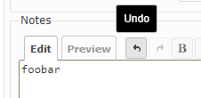

# Redmine Wiki History
This is a plugin for Redmine.  
This plugin adds Undo and Redo buttons to jsToolBar.  
In addition, it overrides the Ctrl+Z, Ctrl+Y or ⌘+Z, ⌘+Y functionality.  



## Compatibility

Only Redmine v5.0.5 has been tested.  
Other versions are untested.

## Installation
### When using git
1. Change the current directory to the Redmine plugin directory.
    ```
    cd YOUR_REDMINE_DIRECTORY/plugins
    ```
2. Clone this repository.
    ```
    git clone https://github.com/sk-ys/redmine_wiki_history.git
    ```
2. Restart Redmine.

### When not using git
1. Download zip file from the [release page](https://github.com/sk-ys/redmine_wiki_history/releases) or the [latest main repository](https://github.com/sk-ys/redmine_wiki_history/archive/refs/heads/main.zip). 
2. Extract the ZIP file to your Redmine plugin directory. The name of the unzipped directory must be `redmine_wiki_history`.
3. Restart Redmine.

## Uninstallation
1. Remove this plugin directory from the plugins directory.
2. Restart Redmine.
